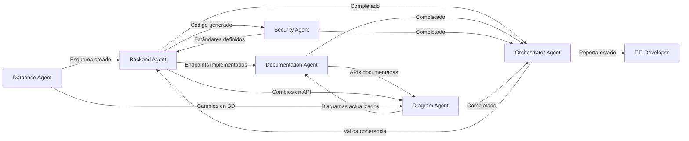

# 🤖 AGENTS.md - Registro Central de Agentes FadeBooker

**Última actualización:** 19 de mayo de 2026  
**Versión:** 1.5.0  
**Estado:** Fase Implementación (Integración React-Backend & Refuerzo de Resiliencia)

---

## 🏛️ Directrices Innegociables (La Ley)

Todos los agentes deben adherirse estrictamente a estas reglas:
- **Arquitectura Hexagonal:** Obligatoria en backend con inyección de dependencias.
- **Self-healing Aware:** Lógica resiliente ante fallos de infraestructura.
- **Validación Defensiva:** El middleware `validateRequest` debe ser robusto y no colapsar ante fallos de mapeo de errores (blindaje Power Apps).
- **Feature-Based Frontend:** Desarrollo por slices funcionales (No Atomic Design).
- **Power Platform Sync:** Mantener `swagger_powerapps.json` bajo estándar **Swagger 2.0**.
- **Log de Errores:** Auditoría obligatoria en `LogErrores`.
- **Docker First:** El backend debe ejecutarse sobre `node:20-alpine` para garantizar consistencia.
- **Mercado Pago v2:** Migración obligatoria a SDK v2 para toda lógica de pagos.
- **Anti-Duplicación:** Estricta vigilancia contra SyntaxErrors por duplicación de bloques.
- **Limpieza de Conflictos:** Prohibido dejar marcadores de conflicto (`<<<<<<<`, `=======`, `>>>>>>>`) en el código. Siempre resolver antes de reportar éxito.
- **Validación Pre-Commit:** Verificar que el código sea sintácticamente válido antes de realizar commits o sugerir arranques de servidor.

---

## 📋 Descripción General

Este archivo es la **fuente única de verdad** para el registro y estado de los agentes en el ecosistema FadeBooker. Para guías de implementación detalladas, consulte los archivos individuales en [`.github/agents/`](.github/agents/).

Para entender la estructura completa del proyecto, ver: [CODEBASE_STRUCTURE.md](../CODEBASE_STRUCTURE.md)

---

## 🎯 Registro de Agentes

| Agente | Propósito Principal | Estado | Instrucciones |
| :--- | :--- | :--- | :--- |
| **Database Agent** | Gestión de esquema SQL Server y migraciones | ✅ Activo | [Instrucciones](agents/database-agent.md) |
| **Backend Agent** | Desarrollo de API Node.js (Ark. Hexagonal) | ✅ Activo | [Instrucciones](agents/backend-agent.md) |
| **Frontend Agent** | Migración React a Feature-Based Architecture | ✅ Activo | [Instrucciones](agents/frontend-agent.md) |
| **Documentation Agent** | Creación de manuales, READMEs y reporte Office | ✅ Activo | [Instrucciones](agents/documentation-agent.md) |
| **Diagram Agent** | Visualización de arquitectura y flujos (draw.io) | ✅ Activo | [Instrucciones](agents/diagram-agent.md) |
| **Testing Agent** | Pruebas (unit, integracion, estres) y diagnóstico Azure | ✅ Activo | [Instrucciones](agents/testing-agent.md) |
| **PowerApps Agent** | Desarrollo de Low-Code Apps e integración | ✅ Activo | [Instrucciones](agents/powerapps-agent.md) |
| **Power-Automate Agent**| Automatización de flujos y conectores | ✅ Activo | [Instrucciones](agents/power-automate-agent.md) |
| **Security Agent** | Auditoría de código y estándares de seguridad | 🆕 Iniciando | [Instrucciones](agents/security-agent.md) |
| **Github Git Agent** | Gestión de commits y flujo de trabajo Git | ✅ Activo | [Instrucciones](agents/github-git-agent.md) |
| **Photographer-AI Agent**| Lógica de simulación y procesamiento de imagen | 🆕 Planificado | [Instrucciones](agents/photographer-ai-agent.md) |
| **Orchestrator Agent** | Coordinación de flujos multi-agente complejos | ✅ Activo | [Instrucciones](agents/orchestrator-agent.md) |

---

## 🚀 Estado Actual del Proyecto

**Hito Actual:** 5.9 - Integración Frontend-Backend inicial.

| Módulo | Progreso | Notas |
| :--- | :--- | :--- |
| **Backend Core** | 98% | Endpoints de Citas y Barberos expandidos. |
| **Base de Datos** | 100% | Esquema estable, triggers de auditoría configurados. |
| **Frontend React** | 40% | Migración a Feature-Based en curso. Auth listo. |
| **Power Apps** | 90% | Integración exitosa, conectores parchados. |
| **Security/JWT** | 80% | Validaciones de tokens activas. |
| **Deployment** | 100% | Azure CD funcional vía ACR. |

| Componente | Estado | Completado | Detalles |
|:-----------|:------:|:----------:|----------|
| **Database** 🗄️ | ✅ Complete | **100%** | 36 objetos BD, 51 registros test, triggers validados |
| **Backend** 🔧 | ✅ Complete | **92%** | APIs CRUD funcionales, falta: E2E tests, CI/CD |
| **Documentation** 📋 | ✅ Complete | **100%** | APIs, procesos, arquitectura documentados |
| **Diagram** 📐 | ✅ Complete | **100%** | ER, arquitectura, flujos en draw.io |
| **Security** 🔐 | 🆕 Starting | **0%** | Auditoría pendiente, estándares JWT/CORS a definir |
| **Frontend** 🎨 | 🆕 Starting | **0%** | Migración Power Pages → React |
| **Orchestrator** 🎛️ | ✅ Active | — | Coordinación en progreso |

**Progreso total:** ~50% (Core backend listo, frontend y seguridad iniciando)

---

## 🛠️ Responsabilidades y Skills

### 1️⃣ **Database Agent** 🗄️
**Status:** ✅ **COMPLETADO**
**Skill Principal:** [sql-migration](skills/sql-migration.md)

### 2️⃣ **Backend Agent** 🔧
**Status:** ✅ **COMPLETADO (95%)**
**Contexto:** Arquitectura Hexagonal (Clean Architecture). Protocolo de Onboarding (User -> Barbero) consolidado. Endpoints de perfil `/usuarios/perfil` (GET/PUT) funcionales.

### 5️⃣ **Orchestrator Agent** ⚖️
**Status:** ✅ **ACTIVO**
**Acción Reciente:** Verificación final de flujos críticos y sincronización de Swagger 2.0 completada. Delegación activa al `@github-git-agent` para estandarización de commits.

### 6️⃣ **Github Git Agent** 🐙
**Status:** ✅ **ACTIVO**
**Responsabilidad:** Asegurar que cada commit siga el patrón `X.X. Titulo` + Cuerpo descriptivo en Español. Automatizar la generación de mensajes de commit coherentes con el progreso del proyecto.


---

## 🚀 Estado Actual del Proyecto  
**Puerto:** 3000

---

### 3️⃣ **Frontend Agent** 🎨
**Status:** 🆕 **INICIANDO**

**Responsabilidades:**
- Migrar de Power Pages a React (Feature-Based Architecture)
- Diseñar componentes reutilizables
- Implementar routing y autenticación
- Crear sistema de diseño con Tailwind CSS
- Integrar con APIs del backend
- UX/UI para flujos de barbería

**Stack:** React 18, TypeScript, Vite, Tailwind CSS, React Router v6, React Query, Axios  
**Ubicación:** [`Producto/front-fadebooker/`](../Producto/front-fadebooker/)  
**Puerto:** 5173

**Legacy (Power Pages):** [`Producto/pages-fadebooker/`](../Producto/pages-fadebooker/)

**Instrucciones completas:** [`.github/agents/frontend-agent.md`](agents/frontend-agent.md)

**Ejemplo de uso:**
```
@frontend-agent: Migra la página de búsqueda de barberos de Power Pages a React.
Crea componentes: BarberList, BarberCard, SearchFilters, BarberDetail.
Implementa navegación y carrito de servicios.
```

---

### 4️⃣ **Documentation Agent** 📋
**Status:** ✅ **COMPLETADO**

**Logros:**
- ✅ README.md con overview del proyecto
- ✅ GETTING_STARTED.md con instrucciones de setup
- ✅ API_DOCUMENTATION.md con todos los endpoints
- ✅ BACKEND_CONSOLIDADO.md
- ✅ DATABASE_CONSOLIDADO.md
- ✅ CODEBASE_STRUCTURE.md con rutas y convenciones

**Responsabilidades:**
- Documenta APIs generadas por Backend Agent
- Crea manuales de usuario y guías de instalación
- Mantiene especificaciones del producto
- Documenta procesos (testing, deployment, contribución)
- Mantiene CHANGELOG y versionado

**Ubicación:** [`Documentación/md-fuente/`](../Documentación/md-fuente/)

**Instrucciones completas:** [`.github/agents/documentation-agent.md`](agents/documentation-agent.md)

---

### 5️⃣ **Diagram Agent** 📐
**Status:** ✅ **COMPLETADO**

**Logros:**
- ✅ Diagrama ER convertido a draw.io
- ✅ Diagrama de arquitectura
- ✅ Flujos de procesos principales

**Responsabilidades:**
- Convierte documentos visuales (PDFs, imágenes) a draw.io editable
- Mantiene diagramas actualizados con cambios
- Crea nuevos diagramas (flujos, componentes, secuencias)
- Exporta diagramas a PNG/SVG para documentación

**Ubicación:** [`Documentación/Material complementario/`](../Documentación/Material%20complementario/)

**Instrucciones completas:** [`.github/agents/diagram-agent.md`](agents/diagram-agent.md)

---

### 6️⃣ **Security Agent** 🔐
**Status:** 🆕 **INICIANDO**

**Responsabilidades:**
- Auditoría de código (Backend y Frontend)
- Validación de OWASP Top 10
- Definición de estándares JWT y CORS
- Revisión de dependencias (CVE check)
- Threat modeling y hardening
- Recomendaciones de remediación

**Stack:** OWASP standards, JWT, bcrypt, input validation, rate limiting

**Instrucciones completas:** [`.github/agents/security-agent.md`](agents/security-agent.md)

**Ejemplo de uso:**
```
@security-agent: Audita el backend para vulnerabilidades OWASP Top 10.
Revisa autenticación (JWT), validaciones de input, manejo de datos sensibles.
Genera reporte con recomendaciones.
```

---

### 7️⃣ **PowerApps Agent** 📱
**Status:** ✅ **ACTIVO**

**Responsabilidades:**
- Desarrollar aplicaciones Low-Code sobre Azure SQL
- Integrar formularios complejos y dashboards
- Configurar autenticación y roles en Power Platform

**Instrucciones completas:** [`.github/agents/powerapps-agent.md`](agents/powerapps-agent.md)

---

### 8️⃣ **Power-Automate Agent** ⚡
**Status:** ✅ **ACTIVO**

**Responsabilidades:**
- Crear flujos automatizados (aprobaciones, notificaciones)
- Implementar conectores personalizados para las APIs Node.js
- Sincronizar datos entre SQL Server y servicios externos

**Instrucciones completas:** [`.github/agents/power-automate-agent.md`](agents/power-automate-agent.md)

---

### 9️⃣ **Orchestrator Agent** 🎛️
**Status:** ✅ **ACTIVO**

**Responsabilidades:**
- Coordina flujos multi-agente
- Valida coherencia entre dominios (BD ↔ Backend ↔ Docs ↔ Diagramas)
- Reporta estado del proyecto
- Resuelve inconsistencias
- Planifica sprints y fases

**Flujo Coordinado Estándar:**
```
1. Database Agent → Define tablas necesarias
2. Backend Agent → Implementa servicios y endpoints
3. Documentation Agent → Documenta APIs
4. Diagram Agent → Actualiza diagramas
5. Security Agent → Audita
6. Orchestrator Agent → Valida coherencia total
```

**Instrucciones completas:** [`.github/agents/orchestrator-agent.md`](agents/orchestrator-agent.md)

**Ejemplo de uso:**
```
@orchestrator-agent: Implementa Historia Usuario "Crear Sesión Fotográfica".
Coordina DB → Backend → Docs → Diagrams → Security.
Reporta cuando esté completo.
```

### 🔟 **DevOps Agent** 🚀
**Propósito:** Automatizar la infraestructura, dockerización y despliegue en Azure.

**Responsabilidades:**
- Crear y optimizar archivos Docker (Dockerfile, compose).
- Configurar CI/CD vía GitHub Actions.
- Gestionar despliegue en Azure App Service/Container Registry.
- Asegurar gestión segura de variables de entorno y secrets.

**Instrucciones:** [`.github/agents/devops-agent.md`](agents/devops-agent.md)

**Status:** ✅ **ACTIVO** (10% completado - Docker base listo)

---

## 📞 Coordinación Entre Agentes



---

## 🔗 Referencias Útiles

- **Instrucciones Globales:** [`copilot-instructions.md`](copilot-instructions.md)
- **Codebase Structure:** [`CODEBASE_STRUCTURE.md`](../CODEBASE_STRUCTURE.md)
- **Documentación Proyecto:** [`Documentación/`](../Documentación/)
- **Backend:** [`Producto/back-fadebooker/`](../Producto/back-fadebooker/)
- **Frontend:** [`Producto/front-fadebooker/`](../Producto/front-fadebooker/)
- **Conexión BD:** `fadebooker-server.database.windows.net / FadeBooker_DB`
- **Repositorio Local:** `c:\Users\SanNi\OneDrive\Escritorio\Barberia\FadeBooker`

---

## 🚀 Cómo Usar Este Archivo

### Para invocar un agente:
```markdown
@nombre-agent: [descripción de tarea]
```

### Ejemplos completos:
```markdown
@database-agent: Crear tabla ServicioFoto con campos id_sesion, id_fotografo, fecha_sesion, duracion_minutos

@backend-agent: Generar CRUD para SessionFoto en /api/sessions endpoint con validaciones

@frontend-agent: Crear página de sesiones con filtros por fecha y estado

@documentation-agent: Documentar endpoints de sesiones en API_DOCUMENTATION.md

@diagram-agent: Actualizar ER con tabla ServicioFoto y crear flujo "Crear Sesión"

@security-agent: Auditar endpoints de sesiones para validación de permisos

@orchestrator-agent: Coordina implementación completa de "Crear Sesión Fotográfica"
```

---

## ✅ Checklist para Completar Feature

- [ ] Database Agent: Tablas/migraciones creadas
- [ ] Backend Agent: Endpoints CRUD implementados
- [ ] Backend Agent: Validaciones y error handling
- [ ] Security Agent: Auditoría pasada
- [ ] Documentation Agent: APIs documentadas
- [ ] Diagram Agent: Diagramas actualizados
- [ ] Orchestrator Agent: Coherencia validada
- [ ] Git: Cambios commiteados

---

**Para más detalles sobre arquitectura y convenciones:** Ver [`copilot-instructions.md`](copilot-instructions.md)
