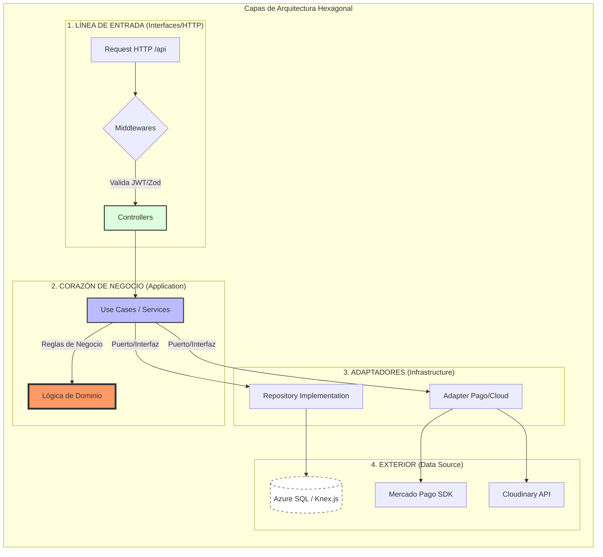

# 🏛️ Diagrama de Arquitectura Hexagonal - FadeBooker

Este diagrama representa el flujo de datos y la organización de patrones de diseño en el backend de FadeBooker, siguiendo los principios de **Clean Architecture**.

### 📝 Resumen Técnico para Presentación

- **Domain:** Entidades puras y reglas esenciales (independiente de tecnología).
- **Application:** Servicios que orquestan los casos de uso del negocio.
- **Infrastructure:** Puertos y adaptadores para DB (Azure SQL), Pagos (Mercado Pago) e Imágenes (Cloudinary).
- **Interfaces:** Controladores REST protegidos por middlewares de seguridad.
