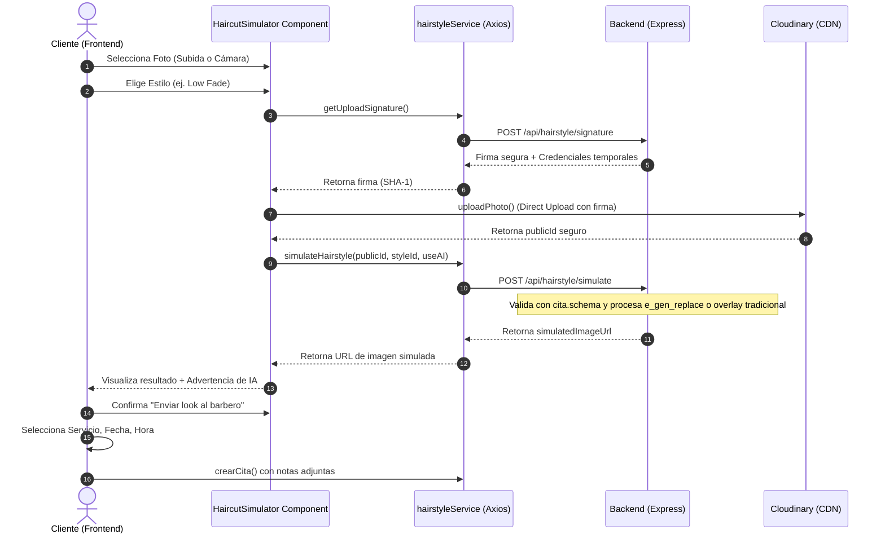

# 🎨 Frontend Consolidado - FadeBooker

**Arquitectura:** React 18 + Power Pages Integration (Opción B)
**UI Kit:** Bootstrap 5 (Reemplazando Tailwind para compatibilidad con Power Pages)
**Estado:** ✅ Fase 1 Completada (Layout y Búsqueda)

---

## 🏗️ Estrategia de Integración

FadeBooker utiliza una arquitectura híbrida donde **React** maneja la interactividad compleja dentro de **Power Pages (Microsoft)**.

- **Frontend Agent:** Activo para la implementación de UI/UX.
- **Communication:** Cliente HTTP centralizado (`api-service.js`) con manejo de tokens JWT y Refresh Tokens.
- **Styling:** Migración a Bootstrap 5 para asegurar consistencia visual con el runtime de Power Pages.

---

## 📦 Componentes Clave

1. **api-service.js:** 
   - Cliente HTTP que encapsula 20+ métodos (getBarbers, createAppointment, login, etc.).
   - Manejo automático de entornos (Dev/Prod) y seguridad (Refresh Tokens en cookies Secure).
2. **SearchBarbers.js:**
   - Componente React para búsqueda dinámica de barberos.
   - Filtros por especialidad y calificación en tiempo real.
3. **Dashboard de Gestión (RF-FE-02):**
   - Panel para dueños de barberías con visualización de ingresos.

---

## 🛠️ Herramientas y Workflow

- **PAC CLI:** Herramienta oficial para sincronización:
  - `pac pages download`: Descarga el portal localmente.
  - `pac pages upload`: Sube los cambios al entorno de Azure.
- **React Runtime:** Cargado via CDN para minimizar el bundle subido al portal.

---

## 🛡️ Seguridad Frontend

- **OWASP Integration:** Validación de inputs y sanitización contra XSS.
- **Auth Flow:**
  - Access Token (JWT) en memoria.
  - Refresh Token en cookie `HttpOnly`, `Secure`, `SameSite=Strict`.

---

## 🤖 Módulo de Simulación de Peinados Inteligente (IA & Cloudinary)

Se ha implementado un sistema interactivo para que el cliente pueda previsualizar cortes sobre una foto de su rostro antes de reservar. Esta funcionalidad corre de forma adaptativa y utiliza Inteligencia Artificial Generativa de Cloudinary (`e_gen_replace`) o overlays tradicionales en caso de limitaciones de cuota.

### 🖼️ Flujo del Simulador

---
*Documento unificado y consolidado el 1 de junio de 2026.*
